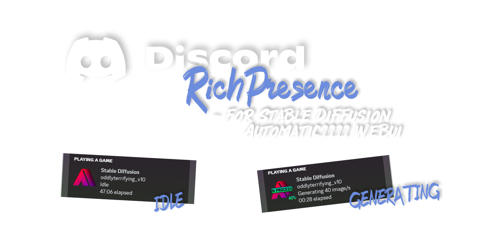

Discord Rich Presence
=======
Dynamic Discord rich presence (only) for [AUTOMATIC1111's WebUI](https://github.com/davehornik/stable-diffusion-webui).
-----------

## Features
- Current model you are using
- Dynamically changes your status
    - Idle
    - Generating XX image/s'
        - Showing progress in percentage
        - Time elapsed
- Also changes status image based on activity

## Future plans
- [ ] Add options page for following:
    - [ ] ON/OFF for Dynamic status
    - [ ] ON/OFF for Percentage progress
    - [ ] Custom buttons (maybe, we'll see)
- Send us your ideas!

## Contributors
- Idea & graphics and "PR" by [davehornik](https://github.com/davehornik/)
- Coding mainly done by [Edesak](https://github.com/Edesak)
